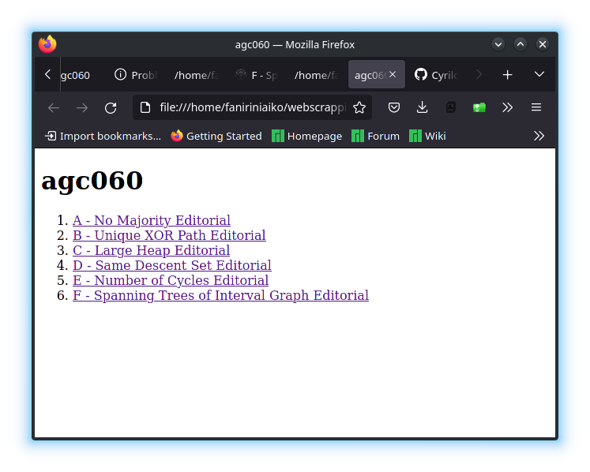
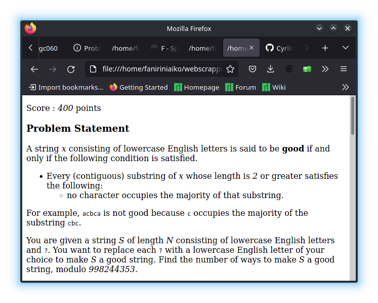

# AtcoderContest
Web scraper for saving locally any contest from atcoder's website



## Usage
Install all required modules 
```
pip install -r requirements.txt

```
Then modify and run main.py

```
python3 main.py

```
